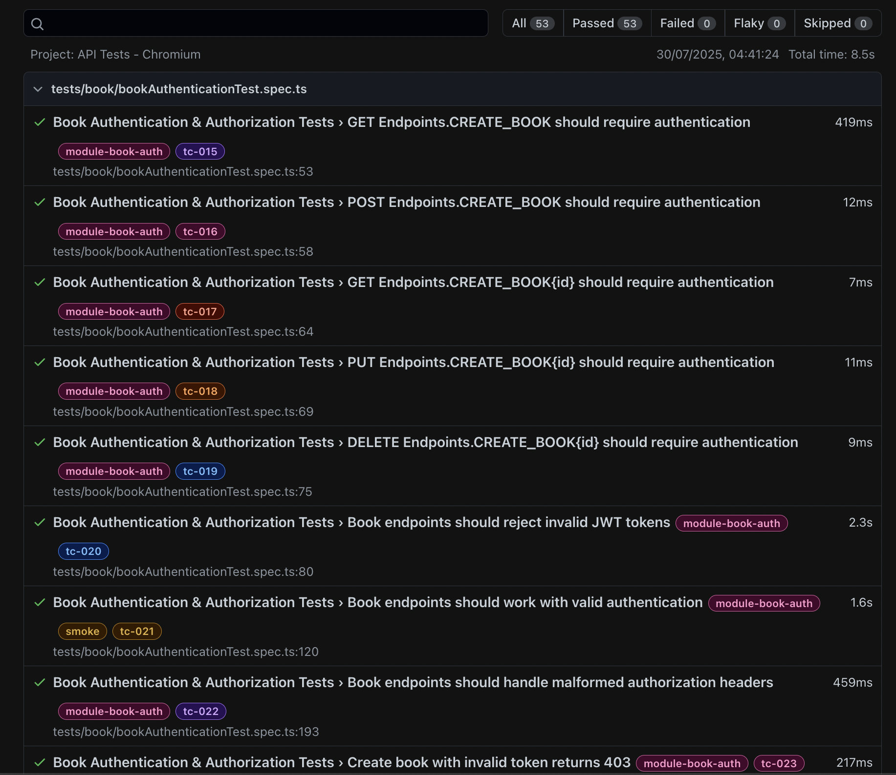
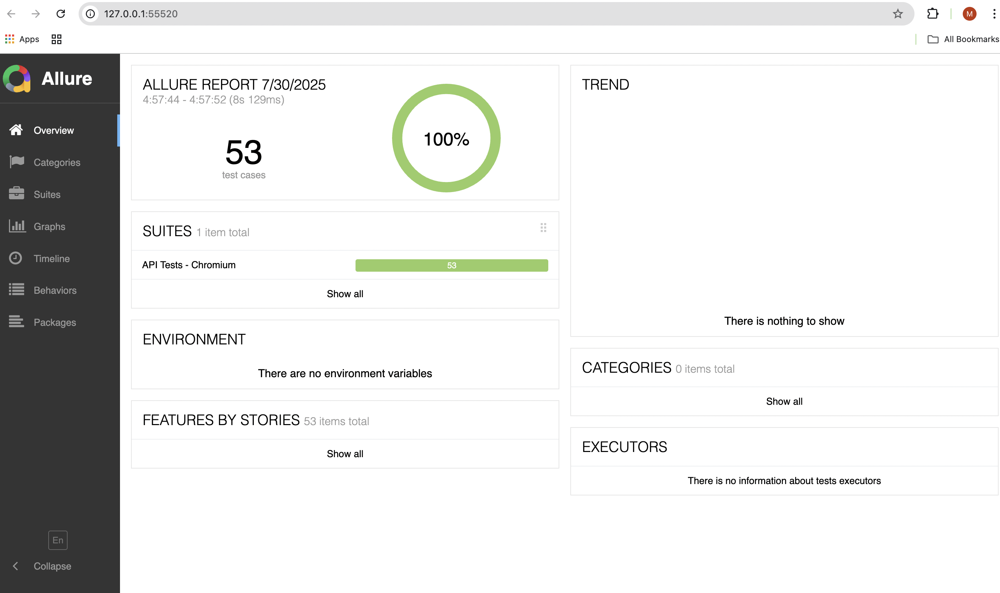

# 📚 - BookStore QA Framework (Playwright Test)

This project is an **API automation framework** developed with **Playwright and TypeScript** to validate the key functionalities of a **BookStore application**. It ensures reliable coverage across user authentication, health checks, and book CRUD operations with modular test design, reusable components, and environment support.

## 🔧 Tools & Framework Components

- **TypeScript**: Strongly typed language for writing scalable and maintainable code.
- **Playwright**: Core automation tool for API and browser interactions.
- **dotenv**: Manages environment variables and secrets.
- **Node.js**: Runtime for executing the TypeScript/JavaScript test suite.
- **Playwright Test Runner**: Executes and organizes test cases.
- **Allure Reporting**: Advanced test reporting with detailed analytics.
- **GitHub Actions**: CI/CD integration for seamless test execution on code changes.

## 📊 Validation Scope

The framework validates multiple aspects of the BookStore APIs, including:

- ✅ **Positive Test Cases**
  - Health check endpoint validation
  - User sign-up and login with valid credentials
  - Token-based authenticated book creation
  - Retrieve all books
  - Retrieve individual book details
  - Update and delete book entries
  - Integration tests with end-to-end workflows

- ❌ **Negative Test Coverage**
  - Creating books with invalid or missing fields (e.g., null/empty title or author)
  - API access with invalid/missing tokens
  - Attempting operations on non-existent books
  - Invalid login/signup attempts
  - Error validation for edge cases and special characters

- 🔗 **Request Chaining**
  - Access token from login API is dynamically reused in headers for secure book-related API operations.
  - Cleanup context for automatic resource cleanup after tests.

## 📘 Quality Assurance Strategy

### 🧪 1. **Test Design & Architecture**

- Organized test modules for each functional area: health, user, book, integration, and helper.
- Used Playwright's `test.describe`, `test.beforeAll`, and `test.afterAll` hooks for setup/teardown.
- Implemented global setup/teardown for environment metadata and artifact cleanup.
- **Instance-based context classes** for isolated test data management.
- Test scenarios include both positive and negative validations.
- Direct Playwright API calls with comprehensive error handling and logging.

#### **🏷️ Test Tagging System**
The framework implements a comprehensive test tagging system for organized test execution:

**🔴 Smoke Tests** (Basic CRUD operations - crucial for API testing)
- Health endpoint validations
- User creation and authentication
- Book CRUD operations
- Book authentication with valid tokens

**🟡 Regression Tests** (Comprehensive end-to-end tests)
- Complete user journey with multiple book operations

**⚪ Validation Tests** (Error handling, security, edge cases)
- User error validations
- Book authentication and error validations

**📦 Module Tags** (Organized by functional areas)
- `@module-health` - Health check tests
- `@module-user` - User account tests
- `@module-user-error` - User error validation tests
- `@module-book` - Book CRUD tests
- `@module-book-auth` - Book authentication tests
- `@module-book-error` - Book error validation tests
- `@module-integration` - Integration tests

### 🧰 2. **Reliability & Maintainability**

- **Centralized Configuration**: Multi-environment JSON configs (dev, qa, prod) with Configuration Manager singleton pattern.
- **Separation of Concerns**: Distinct packages for configuration, data models, context management, utilities, and test organization.
- **Comprehensive Assertions**: Validate status codes, response structure, error messages, and data integrity.
- **Positive & Negative Testing**: Both valid and invalid scenarios for each endpoint with edge case coverage.
- **Reusable Components**: Helper methods for logging, token management, error validation, and data generation.
- **Test Lifecycle Management**: Global setup/teardown for environment metadata and artifact cleanup.
- **Resource Management**: Automatic cleanup of created resources using CleanupContext with timestamp tracking.

### 🧠 3. **Challenges & Solutions**

| Challenge                                                        | Problem                                                                  | Solution                                                                 |
|------------------------------------------------------------------|--------------------------------------------------------------------------|--------------------------------------------------------------------------|
| **Token Management Across Tests**                                | Tests needed to share authentication tokens but maintain isolation       | Implemented AuthContext with automatic token storage and injection. Shared token setup in beforeAll hooks for test suites. Token reuse across multiple tests within the same describe block. No manual token management required. |
| **Test Data Collisions**                                         | Parallel test execution caused data conflicts                            | Instance-based context classes with isolated data per test. Unique identifier generation with timestamps and counters. Automatic cleanup after each test using CleanupContext. beforeEach hooks for fresh data creation per test. |
| **API Response Inconsistencies**                                 | APIs returned unexpected status codes or error messages                 | Direct API calls with comprehensive error handling and logging. Detailed response validation including status codes, body structure, and error messages. TypeScript interfaces for response structure validation. Custom helper functions for common assertions. |
| **Environment Configuration**                                     | Different environments needed different configurations                    | Configuration Manager with singleton pattern for centralized config access. Environment-specific JSON configs (dev.json, qa.json, prod.json). Runtime environment switching with ENV variable. Password and API key management per environment. |
| **Resource Cleanup**                                             | Created resources weren't being cleaned up properly                     | Complete test lifecycle management: beforeAll (shared setup), beforeEach (per-test setup), afterEach (per-test cleanup), afterAll (shared cleanup). CleanupContext with timestamp tracking for created resources. Automatic cleanup with proper error handling. Global teardown for artifact cleanup (files older than 7 days). Sort by timestamp to ensure proper cleanup order. |
| **Test Maintenance**                                             | Tests were hard to maintain and extend                                  | Modular design with reusable components (TestDataFactory, context classes). Consistent patterns across all tests with shared fixtures. TypeScript interfaces for type safety and better IDE support. Clear separation of concerns with dedicated packages. |


## ⚙️ CI/CD Pipeline

### 🔁 **Pipeline Triggers**
- Runs on **push** and **pull request** events targeting `main` and `develop` branches
- Manual workflow dispatch with environment selection
- Automatic test execution with proper error handling

### 🚀 **Pipeline Stages**

#### **1. Environment Setup**
- Checkout source code using `actions/checkout@v4`
- Setup Node.js 20 using `actions/setup-node@v4`
- Cache Node.js modules for faster builds
- Install dependencies via `npm ci`

#### **2. Environment Configuration**
- Multi-environment matrix strategy (dev, qa, prod)
- Dynamic environment variable setup
- Secure API key and base URL management via GitHub Secrets
- Environment-specific configuration validation

#### **3. Test Execution**
- Run Playwright API tests across all environments
- Parallel test execution with proper error handling
- Comprehensive test suite including:
  - Health check API tests
  - User authentication API tests
  - Book CRUD API tests
  - Integration API tests
  - Error validation tests
- **Unit Testing**: Playwright/Test supports unit testing of application components
- **Code Coverage**: Built-in coverage reporting with Playwright/Test

#### **4. Reporting & Artifacts**
- Generate HTML test reports
- Generate Allure reports for detailed analytics
- Upload test artifacts and reports
- Provide test execution summary
- Store results for historical analysis
- **Allure Reports**: Advanced analytics with interactive dashboards, test trends, and performance metrics

### 🧱 **Framework Structure**

```
bookstore-api-playwright/
├── allure-results/                   # Test result files from Allure
├── src/
│   ├── config/
│   │   ├── configManager.ts          # Singleton config management
│   │   ├── dev.json                  # Development environment config
│   │   ├── qa.json                   # QA environment config
│   │   └── prod.json                 # Production environment config
│   ├── context/
│   │   ├── authContext.ts            # Authentication token management
│   │   ├── bookDataContext.ts        # Book data isolation
│   │   ├── userDataContext.ts        # User data isolation
│   │   └── cleanupContext.ts         # Resource cleanup tracking
│   ├── data/
│   │   └── testDataFactory.ts        # Test data generation
│   ├── utils/
│   │   └── assertionHelpers.ts       # Reusable assertion functions
│   ├── constants/
│   │   └── endpoints.ts              # API endpoint definitions
│   ├── model/
│   │   ├── book/                     # Book-related data models
│   │   │   ├── CreateBookRequest.ts
│   │   │   ├── CreateBookResponse.ts
│   │   │   ├── DeleteBookResponse.ts
│   │   │   └── BookNotAvailableResponse.ts
│   │   ├── user/                     # User-related data models
│   │   │   ├── UserSignUpRequest.ts
│   │   │   ├── UserSignUpResponse.ts
│   │   │   └── UserAuthResponse.ts
│   │   ├── DetailsResponse.ts
│   │   ├── ErrorResponse.ts
│   │   └── HealthResponse.ts

├── test/                             # API test classes and test suites
│   ├── fixtures/
│   │   └── baseTest.ts               # Test fixtures with context isolation
│   ├── tests/
│   │   ├── health/                   # Health check API tests (@module-health)
│   │   │   └── healthTest.spec.ts    # @smoke tests
│   │   ├── user/                     # User authentication API tests
│   │   │   ├── userAccountTest.spec.ts      # @module-user (@smoke tests)
│   │   │   └── userErrorValidationTest.spec.ts  # @module-user-error
│   │   ├── book/                     # Book CRUD API tests
│   │   │   ├── bookTest.spec.ts              # @module-book (@smoke tests)
│   │   │   ├── bookAuthenticationTest.spec.ts # @module-book-auth
│   │   │   └── bookErrorValidationTest.spec.ts # @module-book-error
│   │   ├── integration/              # End-to-end integration API tests
│   │   │   └── integrationTest.spec.ts       # @module-integration (@regression)

├── test-output/                      # Generated test artifacts and reports
├── global-setup.ts                   # Global test setup
├── global-teardown.ts                # Global test cleanup
├── playwright.config.ts              # Playwright configuration
├── package.json                      # Dependencies and scripts
├── tsconfig.json                     # TypeScript configuration
└── README.md                         # Project documentation
```


### 📈 **Sample Test Report**




*Sample test report generated after execution showing:*
- Test status (pass/fail/skip)
- Duration and execution time
- Logs and errors
- API request/response details
- Detailed test results with tags and file locations
  - Allure reporting with detailed analytics
  - Environment metadata and configuration details
  - Test execution summary with coverage metrics


### 👁️ **View GitHub Actions Reports**

#### **Accessing Reports**
1. Go to your repository → **Actions** tab
2. Select the latest workflow run
3. Scroll down to **Artifacts** section
4. Download the appropriate environment report:
   - `playwright-report-dev` - Development environment results
   - `playwright-report-qa` - QA environment results  
   - `playwright-report-prod` - Production environment results

#### **Report Contents**
Each artifact contains:
- **HTML Reports**: `test-output/html-report/` - Interactive test results
- **Allure Results**: `test-output/allure-results/` - Detailed analytics
- **Test Artifacts**: `test-output/artifacts/` - Screenshots, videos, traces

#### **Multi-Environment Coverage**
- Reports are generated for all environments (dev, qa, prod) in parallel
- Each environment has isolated test execution and reporting
- Environment-specific configuration and secrets are used for each run

## ▶️ **Local Test Execution**

### **Prerequisites**
- Node.js v16+
- npm or yarn
- Git

### **💻 Clone the repository**

```bash
git clone https://github.com/mitali081/bookstore-api-playwright.git
cd bookstore-api-playwright
```

### **🔧 Setup & Run**

1. Install dependencies:
   ```bash
   npm install
   ```

2. Update environment configuration:
   - For QA: Update `src/config/qa.json`
   - For Dev: Update `src/config/dev.json`
   - For Prod: Update `src/config/prod.json`
   
   Or set environment variables:
   ```bash
   export ENV=qa
   export BASE_URL=http://localhost:8000
   export API_KEY=your-api-key
   ```

3. Run tests:
   ```bash
   # Run all tests
   npm test
   
   # Run with parallel execution
   npx playwright test --workers=4
   
   # Run tests by tags
   npx playwright test --grep @smoke          # Run smoke tests
   npx playwright test --grep @regression     # Run regression tests
   npx playwright test --grep @integration    # Run integration tests
   npx playwright test --grep @module-health  # Run health module tests
   npx playwright test --grep @module-user    # Run user module tests
   npx playwright test --grep @module-book    # Run book module tests
   
   # Run specific test categories
   npx playwright test test/tests/user/
   npx playwright test test/tests/book/
   npx playwright test test/tests/health/
   npx playwright test test/tests/integration/
   
   # Run with specific environment
   ENV=qa npx playwright test
   ENV=dev npx playwright test
   ENV=prod npx playwright test
   
   # Run unit tests only
   npm run test:unit
   
   # Run with coverage reporting
   npm run test:coverage
   ```

4. Generate and view reports:
   ```bash
   # Generate Allure report
   npm run allure:generate
   
   # Open Allure report
   npm run allure:open
   
   # View HTML report
   npx playwright show-report
   
   # Open last execution report in browser
   npm run report:open
   
   # Generate and open Allure report in one command
   npm run allure:generate && npm run allure:open
   ```

## 🤝 Contributing

1. Fork the repo  
2. Create a feature branch:
   ```bash
   git checkout -b feature/your-feature
   ```
3. Commit and push changes  
4. Open a pull request

### **Development Guidelines**

- Use instance-based context classes for test data management
- Leverage `TestDataFactory` for test data generation
- Follow the established patterns for new tests
- Ensure tests are isolated and can run in parallel
- Add comprehensive error handling and validation
- Use direct Playwright API calls with proper error handling
- Implement proper cleanup using `CleanupContext`
- Follow multi-environment configuration patterns
- **Add appropriate test tags** (`@smoke`, `@regression`, `@tc-XXX`) for organized test execution
- **Use module tags** (`@module-*`) for functional area organization
- **Follow sequential test case numbering** (tc-001, tc-002, etc.) for easy identification

---

## ✍️ Author
Mitali Sahoo